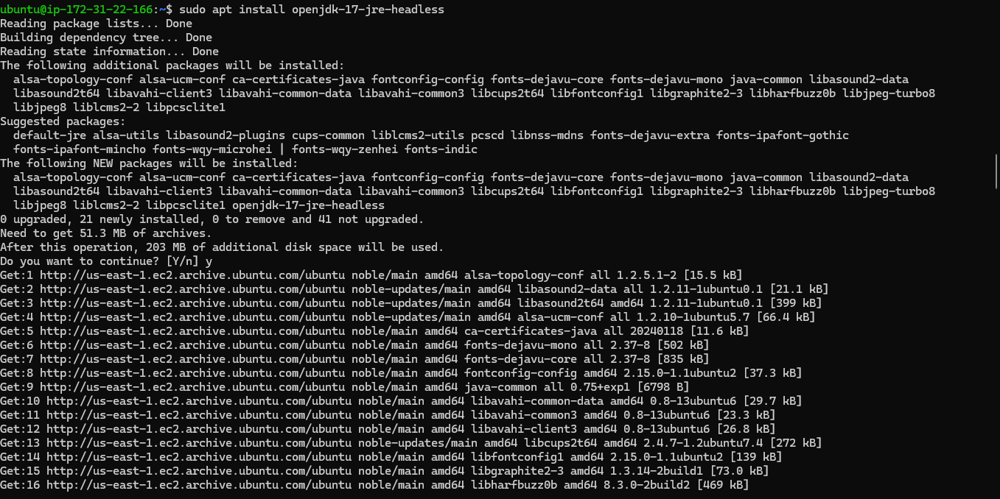
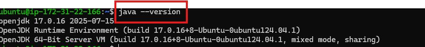
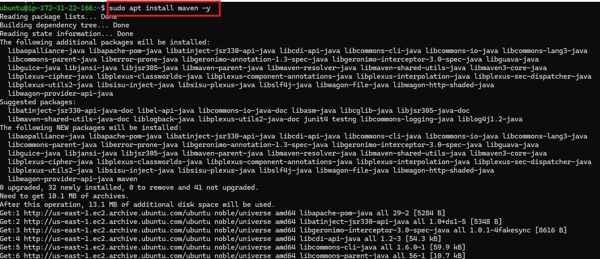
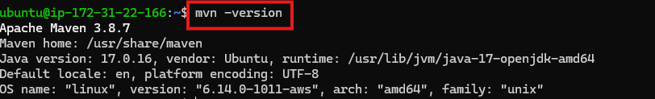
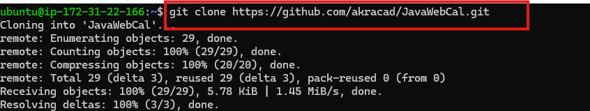
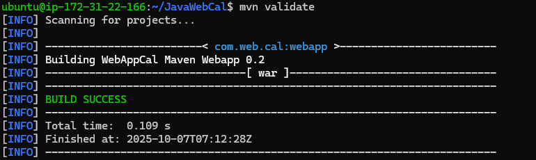
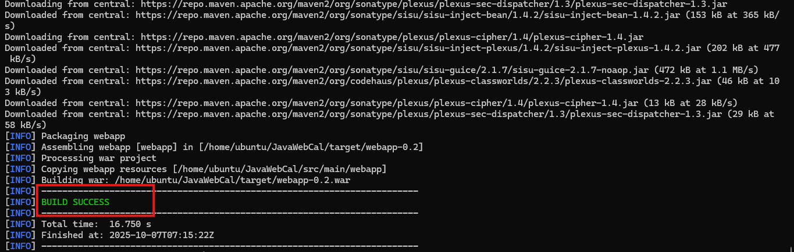

# Deploying a Java Based Application in Tomcat

## Maven is in one Server and deploying application in another server

### Prerequsites :
 
  * Server
  * Java
  * Maven
  * Tomcat

### Steps to Create Ubuntu VM in AWS (EC2)

   1. Log in to AWS
   
   
* Go to AWS Management Console
* Sign in with your AWS account.

2. Go to EC2 Service

* In the search bar, type EC2.

* Click on EC2 (Elastic Compute Cloud).

3. Launch an Instance

* Click Launch Instance.

* Enter a name for your VM (e.g., Ubuntu-VM).

4. Choose Ubuntu AMI (OS)

* Under Application and OS Images (AMI), search for Ubuntu.

* Select the latest Ubuntu Server 22.04 LTS (Free Tier eligible).

5. Choose Instance Type

* For testing/documentation, choose t2.micro (Free Tier eligible).

6. Create / Select Key Pair

* A key pair is needed to connect via SSH.

* If you don’t have one:

* Click Create new key pair.

* Download the .pem file (keep it safe).

7. Configure Network Settings

* In Network settings, allow SSH (port 22) so you can connect.

8. Launch Instance

* Click Launch Instance.

* AWS will start creating your VM.

9. Connect to Your Ubuntu VM

* Go back to EC2 Dashboard → Instances.

* Select your instance → Click Connect.

* AWS shows how to connect:

  Example SSH command:
     
      ssh -i "your-key.pem" ubuntu@<Public-IP-of-Instance>
  Replace your-key.pem with your downloaded key and <Public-IP> with your instance’s IP.

Now you have a running Ubuntu VM in AWS.

You can install software, deploy apps, or use it for documentation.

### Installing Java, Maven and Building of application :

### After Connecting to Ubuntu VM

## step-1:- Update System Packages

*     sudo apt update -y

*     sudo apt upgrade -y

## step-2 Install Java (JDK)

    sudo apt install openjdk-17-jdk -y

* Verify Java Installation :-
    
      java -version

## step-3 Install Apache Maven

### Step 3.1: Install Using APT

        
      sudo apt install maven -y

 

### Step 3.2: Verify Maven Installation

    mvn -version

## step-4 Copy the Code from GitHub (Clone Repository)

    git clone https://github.com/akracad/JavaWebCal.git

    

* After cloning:

      cd project-name

## step-5 Verify the Project Files

* Check the contents:

      ls

You should see a pom.xml file — that means it’s a Maven project.

* Example output:

   pom.xml  src/  README.md

## step-6 validate a code

    mvn validate

## step-6 package a code

    mvn package

After packaging, Maven will create a build file (like .jar or .war) inside the target/ folder.

* Example:

  target/webapp-0.1.war

### Deploying in JBoss Wildfly :

1. Install JBoss

 Note : To install JBoss we need some prerequesites that is Java 
  
  * First Install Java 

use Official Documentation of JBoss to install. there copy the link and run the below command.

    wget https://www.wildfly.org/downloads/

Now go inside extract the tar File

     tar -xvf tar_file_name

Now go inside the folder
    
    cd wildfly

In folder structure go inside the bin

    cd bin

Now start the Jboss by executing standalone.sh

    ./standalone.sh -b 0.0.0.0

Now try to expose Jboss Official site in browser

In the Server A generate key 

    ssh-keygen

It will generate private and public keys 

Copy that public key and paste it in authorized key in Server B

From Server A transfer Artifact to Server B

    scp ~/JavaWebCalculator/target/*.war ubuntu@18.234.109.99:~/Wildfly-11.0.11/standalone/deployments

In the browser paste your second server Public Ip and port number 8080 and the application name .

It will expose our application 

Now we deployed Successfully
 