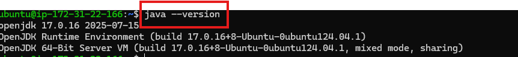
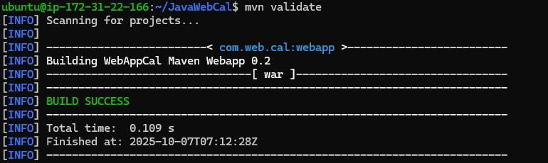

# Deploying a Java based application in Tomcat
## maven is in one server and tomcat is in another server

### Steps to Install Maven, Java, and Build a Java Application

## step-1:- Update System Packages

*     sudo apt update -y

*     sudo apt upgrade -y

## step-2 Install Java (JDK)

    sudo apt install openjdk-17-jdk -y

* Verify Java Installation :-
    
      java -version

## step-3 Install Apache Maven

### Step 3.1: Install Using APT

        
      sudo apt install maven -y

 

### Step 3.2: Verify Maven Installation

    mvn -version

## step-4 Copy the Code from GitHub (Clone Repository)

    git clone https://github.com/akracad/JavaWebCal.git

    

* After cloning:

      cd project-name

## step-5 Verify the Project Files

* Check the contents:

      ls

You should see a pom.xml file — that means it’s a Maven project.

* Example output:

   pom.xml  src/  README.md

## step-6 validate a code

    mvn validate

## step-6 package a code

    mvn package

After packaging, Maven will create a build file (like .jar or .war) inside the target/ folder.

* Example:

  target/webapp-0.1.war

### Deploying in tomcat :
Now create another server and install java and tomcat

In the New Server

 1. Install Tomcat

Note : To install tomcat we need some prerequesites that is Java

* First Install Java

use Official Documentation of Tomcat to install. there copy the link and run the below command.

    wget https://dlcdn.apache.org/tomcat/tomcat-11/v11.0.11/bin/apache-tomcat-11.0.11.tar.gz

 

   * This is tar file , now we need to extract the tar file

    tar -xvf apache-tomcat-11.0.11.tar.gz

  

 * Now we have to start tomcat

  To start tomcat in the tomcat folder structure there is an folder called bin

    sh startup.sh

 

  

## Now we need to transfer aertifact from one server to other server

In the first server generate the key

    ssh-keygen

Now It will generate public key and Private Key

Copy Public Key

Now paste this key in authorised keys of second server

Now It will make connection between the two servers

Now from the first server

    scp ~/JavaWebCalculator/target/*.war ubuntu@18.234.109.99:~/apache-tomcat-11.0.11/webapps

Now It will transfer file to the second server

In the browser paste your second server Public Ip and port number 8080 and the application name .

It will expose our application

Now we deployed Successfully

